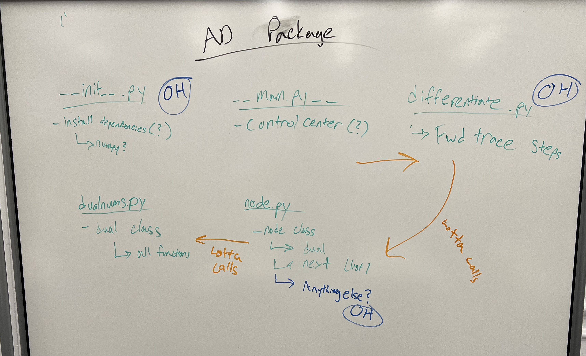

# Milestone 2: Progress

This past week, we met up in Harvard Hall to brainstorm how our package would look (see attached image) and divided up the files for individual research and questions in office hours. We plan on meeting up on Sunday 11/13 to have a group coding grind to finish Milestone 2, in which we work together on creating a work plan, and work independently on each part of the problem and push and pull each commit to and from git. In this format, we will not only avoid merge issues from working on similar parts of the project at the same time, but we will be able to ask each other questions, help debug, and clarify conceptual confusions. 

#### Assigned Tasks/Completed Work

- ###### Nick:
    - Currently working on implementing CI for automatic testing when we push to git
        - Trying to figure out where the .yml file lives and how it works with the test.sh file?
    - Willing to work on test suites
        - writing unit tests/blackbox tests for each python class

- ###### Evan:
    - Brainstormed with the group the file structure of our package
    - Working on installing dependencies, \_\_init__ and main files

- ###### Debbie:
    - Working on differentiate
        - Iterate over nodes
        - Saving forward trace steps
        - Update each node as it is differentiated

- ###### Simran:
    - Working on Dualnums class
        - Implementing the dualnums class
        - Sin, cos, tangent, negation, all the other functions
    - Working on node class
        - self.value, self.next
    - Went to office hours to clarify the implementations of forward and reverse mode, looking ahead to our extension

*We will each complete the documentation for the part that we are individually working on*

#### Notes for implementation

- Need Add, Subtract, Mult, Divide, radd/all other r-methods, Sin, Cos/all 6 trig functions, Power, Negation
- installing dependencies(??): https://python-packaging.readthedocs.io/en/latest/dependencies.html
- Our understanding:

